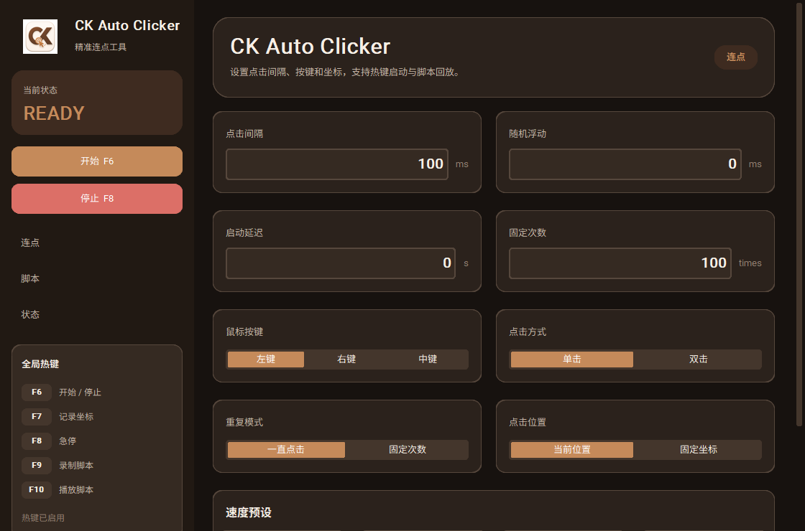
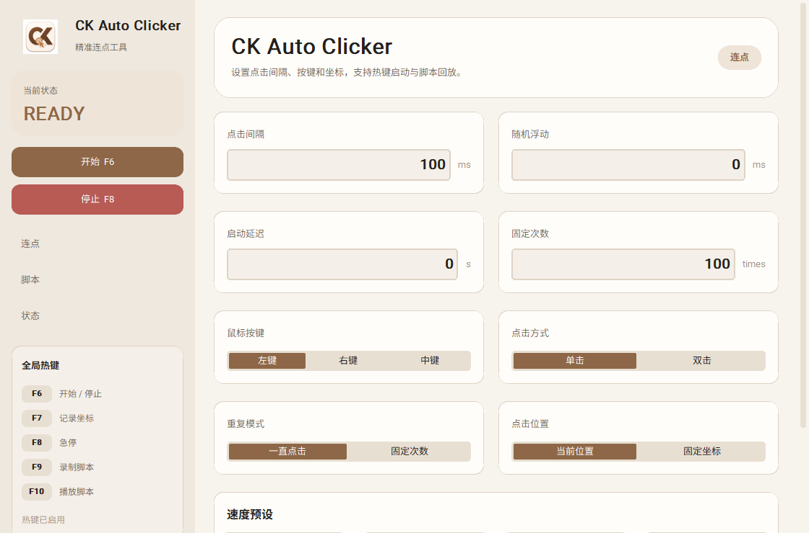

# CK Auto Clicker / CK 连点器


## 中文说明

CK Auto Clicker 是一款 Windows 桌面连点器，支持全局热键、固定坐标点击、脚本录制和脚本回放。项目名统一使用英文形式 `CK Auto Clicker`，软件界面支持 `中文 / English` 切换。

### 界面预览

#### 棕色主题



#### 白色主题



### 功能

- 全局热键：`F6` 开始/停止，`F7` 记录坐标，`F8` 急停，`F9` 录制脚本，`F10` 播放脚本。
- 支持左键、右键、中键。
- 支持单击、双击。
- 支持一直点击或固定次数点击。
- 支持当前位置或固定坐标点击。
- 支持点击间隔、启动延迟和随机浮动。
- 支持脚本录制、保存、加载、文本事件、循环次数和播放速度。
- 支持棕色/白色主题，以及中文/英文界面切换。
- 左上角 CK 图标支持悬停动画，点击可打开 GitHub 项目主页。

### 运行

```powershell
python -m pip install -r .\requirements.txt
python .\main.py
```

也可以双击 `Start CK Auto Clicker.bat`。

### 打包

```powershell
python -m pip install pyinstaller
python -m PyInstaller --noconfirm --clean --onefile --windowed --name CKAutoClicker --icon assets\ck-auto-clicker-icon.ico --add-data "assets;assets" main.py
```

输出文件：

```text
dist\CKAutoClicker.exe
```

## English

CK Auto Clicker is a Windows desktop auto-clicker with global hotkeys, fixed-position clicking, macro recording, and macro playback. The app name is shown as `CK Auto Clicker`, and the interface supports `中文 / English` switching.

### Preview

#### Brown Theme


#### White Theme


### Features

- Global hotkeys: `F6` start/stop, `F7` capture point, `F8` emergency stop, `F9` record macro, `F10` play macro.
- Left, right, and middle mouse button support.
- Single-click and double-click modes.
- Continuous clicking or fixed-count clicking.
- Cursor-position or fixed-point clicking.
- Interval, start delay, and random jitter settings.
- Macro recording, macro save/load, text events, loop count, and playback speed.
- Brown/white themes and Chinese/English UI switching.
- The CK logo has a hover animation and opens the GitHub project page when clicked.

### Run

```powershell
python -m pip install -r .\requirements.txt
python .\main.py
```

You can also run `Start CK Auto Clicker.bat`.

### Build

```powershell
python -m pip install pyinstaller
python -m PyInstaller --noconfirm --clean --onefile --windowed --name CKAutoClicker --icon assets\ck-auto-clicker-icon.ico --add-data "assets;assets" main.py
```

Output:

```text
dist\CKAutoClicker.exe
```

`build`, `dist`, and `*.spec` are local build outputs and are not committed.
